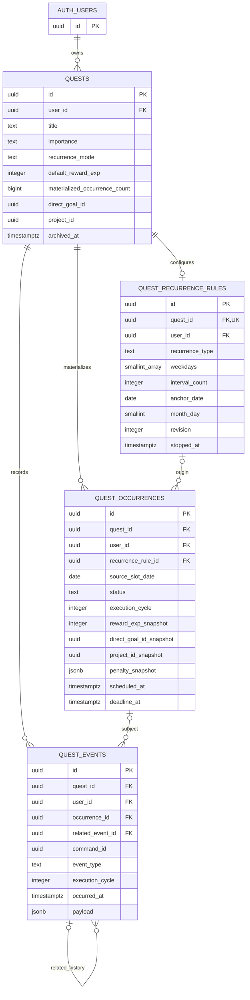

# Quest Engine — PostgreSQL/Supabase V1 physical schema specification

Status: Physical design reconciled with approved SQ-01–04 and DQ-01–04, ready for subsequent migration authoring subject to platform preflight. No SQL, migrations, application code, dependencies or remote Supabase changes are introduced here. External domain implementations remain feature-enablement dependencies.

Owner: Human Product Owner. Date: 2026-09-17.

Authority: [Quest requirements](../01-requirements/quest-engine.md), [Quest domain model](quest-domain-model.md), [project context](../PROJECT_CONTEXT.md) and [accepted decisions](decisions.md). The repository defines no physical Player, Goal, Project, Penalty or profile schema yet. Proposed references below do not imply those tables already exist.

## 1. Purpose

Translate the approved definition/occurrence model and DQ-01–04 into four concrete Quest-owned tables. Specify columns, types, ownership, constraints, indexes and controlled-write contracts so later migrations can enforce the approved behavior without collapsing history or designing other domains.

## 2. Physical Schema Principles

- Use `public.quests`, `public.quest_occurrences`, `public.quest_recurrence_rules` and `public.quest_events`, with RLS enabled before API exposure.
- Use UUID primary keys and explicit owner columns. A definition owns defaults; each materialized occurrence owns fixed execution values and execution state.
- Use typed relational columns for identity, recurrence, validation and common filtering. Reserve JSONB for versioned audit payloads and Penalty-owned policy snapshots.
- Completion Event identity is `quest_events.id` for an accepted `completed` event. Credits belong to Player/EXP, keyed by that ID and reward reason/type.
- Distinguish row constraints from transactional lifecycle rules. Do not try to express cross-row workflows as CHECK constraints.
- Keep client table writes closed; authenticated domain operations enforce transitions, snapshots and archival. RLS remains active within the chosen write boundary.
- Preserve meaningful history with restrictive FKs and append-only events. Do not use cascading deletion to simplify retention.

The row-versus-cross-row distinction follows PostgreSQL's constraint model; unique constraints and FKs handle structural relationships, while cross-row business transitions require controlled operations. [PostgreSQL constraints](https://www.postgresql.org/docs/current/ddl-constraints.html)

## 3. Table Overview

| Table | Row means | Mutable information | Historical protection |
| --- | --- | --- | --- |
| quests | One logical task/template | Defaults, description, recurrence mode, archival marker | Default changes never propagate to existing occurrence snapshots |
| quest_occurrences | One executable instance, including one-off work | Current projection and explicitly edited execution values | Events preserve prior outcomes/configuration; completed facts cannot be rewritten |
| quest_recurrence_rules | One current rule per repeating definition | Rule revision, typed schedule, stop marker | Previous revisions are captured in recurrence_changed events |
| quest_events | One meaningful accepted domain action | None under normal operations | Completion/correction identity and audit payload are append-only |

Completion Event is a kind of QuestEvent, not a fifth table. No EXP balance or transaction ledger is created here.

For every column below: “none” means the caller/domain operation must supply the value, not a silent default. Server clock means `now()` at the database boundary. Integer fields must also reject fractional input before database coercion. Updated timestamps are maintained by controlled writes, not trusted client values.

## 4. quests

| Column | PostgreSQL Type | Nullable | Default | Constraint | Purpose |
| --- | --- | --- | --- | --- | --- |
| id | uuid | No | gen_random_uuid() | Primary key | Stable definition identity |
| user_id | uuid | No | none | FK auth.users.id; immutable | Auth owner |
| title | text | No | none | Trimmed nonblank; character length at most 120 | Task name |
| description | text | Yes | NULL | Character length at most 4000 | Optional detail |
| importance | text | No | side | main or side | Independent importance |
| priority | text | Yes | NULL | low, medium, high, critical | Optional prioritization |
| default_difficulty | smallint | Yes | NULL | 1–5 | Reusable workload default |
| default_estimated_duration_minutes | integer | Yes | NULL | Greater than zero when supplied | Null means unknown; zero invalid |
| default_energy_cost | smallint | Yes | NULL | 1–5 | Default energy estimate |
| default_focus_demand | smallint | Yes | NULL | 1–5 | Default focus estimate |
| default_reward_exp | integer | Yes | NULL | At least zero when supplied | Explicit reward configuration; unresolved allowed before completion |
| direct_goal_id | uuid | Yes | NULL | Cannot coexist with project_id; deferred external FK | Direct parent default |
| project_id | uuid | Yes | NULL | Cannot coexist with direct_goal_id; deferred external FK | Project parent default; derive its Goal |
| recurrence_mode | text | No | one_off | one_off, daily, weekly, monthly, custom | High-level cadence |
| default_penalty_snapshot | jsonb | Yes | NULL | Object with schema_version and applicable_rule_data; optional source_rule_id | Versioned immutable applicable-policy envelope owned semantically by Penalty |
| tags | text[] | No | empty array | One-dimensional array without null elements | Optional tags/categories without new tag tables |
| notes | text | Yes | NULL | No extra strict text limit | User context |
| materialized_occurrence_count | bigint | No | 0 | Nonnegative; server-only monotonic count maintained with new occurrence insertion | Actual materialized instances across this logical Quest; never reset by rule edits |
| archived_at | timestamptz | Yes | NULL | Controlled archive operation only | Retired from normal active use |
| created_at | timestamptz | No | server clock | Immutable | Creation instant |
| updated_at | timestamptz | No | server clock | Server-maintained | Last definition change |

Add a unique key on `(id, user_id)` for owner-safe child FKs. There is no execution status, completion time, earned EXP or formal-criterion field here. A null default reward means unresolved, not zero. A newly materialized occurrence may retain that unresolved value; completing it requires an explicit occurrence-specific assignment. Changing the definition later cannot fill it implicitly.

`default_penalty_snapshot` uses a concrete JSONB envelope: `schema_version` (positive integer), optional `source_rule_id` (Penalty-owned identifier, not a mandatory live FK), and `applicable_rule_data` (object containing immutable rule data needed to interpret the obligation). No separate source-version identifier is mandatory. The occurrence fixes the entire envelope at materialization. Validate supported envelope versions and the Penalty-supplied rule data at the domain boundary; row checks validate its basic object/key shape. JSONB is justified for a versioned cross-domain policy document, while Quest neither normalizes the full Penalty domain nor relies on live source lookup to interpret retained obligations.

## 5. quest_occurrences

| Column | PostgreSQL Type | Nullable | Default | Constraint | Purpose |
| --- | --- | --- | --- | --- | --- |
| id | uuid | No | gen_random_uuid() | Primary key | Executable instance identity |
| quest_id | uuid | No | none | Composite FK with user_id to quests | Parent definition |
| user_id | uuid | No | none | Must match owning Quest through FK; immutable | Direct RLS and user-calendar filtering |
| status | text | No | draft | draft, scheduled, active, completed, failed, cancelled | Current execution state |
| scheduled_at | timestamptz | Yes | NULL | Absolute instant | Planned start; not proof work started |
| deadline_at | timestamptz | Yes | NULL | Not before scheduled_at when both exist | Optional deadline |
| reported_completed_at | timestamptz | Yes | NULL | Allowed only in current completed projection | Backdatable user report |
| recorded_completed_at | timestamptz | Yes | NULL | Present exactly when current status is completed | Authoritative recording time |
| failure_reason | text | Yes | NULL | Allowed reason set; required when failed | Current confirmed reason/context |
| failure_notes | text | Yes | NULL | No extra text limit | Failure explanation |
| recurrence_rule_id | uuid | Yes | NULL | Composite FK to the same Quest's rule | Null for one-off origin |
| recurrence_revision | integer | Yes | NULL | Positive; paired with recurring origin fields | Rule revision used at materialization |
| source_slot_date | date | Yes | NULL | Required for recurring origin; unique within Quest | Immutable original local calendar slot |
| source_timezone | text | Yes | NULL | Nonblank if recurring; validated IANA zone at materialization | Historical conversion provenance, not a per-series setting |
| reward_exp_snapshot | integer | Yes | NULL | At least zero; required on completion | Fixed executable reward |
| difficulty_snapshot | smallint | Yes | NULL | 1–5 | Fixed difficulty |
| estimated_duration_minutes_snapshot | integer | Yes | NULL | Greater than zero when supplied | Fixed duration; null remains unknown |
| energy_cost_snapshot | smallint | Yes | NULL | 1–5 | Fixed energy estimate |
| focus_demand_snapshot | smallint | Yes | NULL | 1–5 | Fixed focus estimate |
| direct_goal_id_snapshot | uuid | Yes | NULL | Mutually exclusive with project_id_snapshot | Fixed direct attribution |
| project_id_snapshot | uuid | Yes | NULL | Mutually exclusive with direct_goal_id_snapshot | Fixed Project attribution |
| penalty_snapshot | jsonb | Yes | NULL | Same schema_version / optional source_rule_id / applicable_rule_data envelope as definition | Fixed applicable rule data independent of source existence |
| execution_cycle | integer | No | 1 | Positive; changes only on accepted reopen | Distinguishes an intentional new execution from stale completion requests |
| created_at | timestamptz | No | server clock | Immutable | Materialization instant |
| updated_at | timestamptz | No | server clock | Server-maintained | Projection/configuration change |

Add unique keys `(id, user_id)` and `(id, quest_id, user_id)` for dependent references. Duplicating `user_id` costs storage and needs an owner-consistency FK, but makes four-table RLS and user-wide schedule queries direct. Deriving it only through Quest avoids duplication but requires joins in every child policy/query. Choose duplication with immutable ownership and composite FKs; never trust a supplied child owner independently.

All seven approved execution values are copied/fixed in the materialization operation, including nulls. Definition updates do not issue child snapshot updates. Explicit edits of an unfinished instance append meaningful before/after history. A completed event retains a full execution snapshot, so reopening and later edits cannot rewrite an earlier completion's reward, workload, parent or Penalty facts. The current row is a projection; immutable event payloads retain earlier cycles.

Recurring origin fields are all present together, or all null for one-off work. `source_slot_date` identifies the intended calendar occurrence independently of mutable scheduled_at, rule revision and timezone conversion. The supported patterns have at most one slot per local date; no multiple-times-per-day feature is introduced. A separate per-instance sequence is unnecessary: quests.materialized_occurrence_count tracks cumulative actual materializations, while the original-slot uniqueness key handles deduplication.

## 6. quest_recurrence_rules

| Column | PostgreSQL Type | Nullable | Default | Constraint | Purpose |
| --- | --- | --- | --- | --- | --- |
| id | uuid | No | gen_random_uuid() | Primary key | Stable rule identity across revisions |
| quest_id | uuid | No | none | Unique; composite FK with user_id to quests | At most one rule row per definition |
| user_id | uuid | No | none | Matches Quest owner; immutable | Owner isolation |
| recurrence_type | text | No | none | daily, selected_weekdays, monthly, every_n_days, every_n_weeks | Concrete schedule kind |
| interval_count | integer | Yes | NULL | Positive only for every_n_days/every_n_weeks; otherwise null | N for custom intervals |
| weekdays | smallint[] | Yes | NULL | For selected_weekdays only: nonempty, unique ISO weekday values 1–7 | Monday=1 through Sunday=7 |
| month_day | smallint | Yes | NULL | 1–31 for monthly only; otherwise null | Target date with final-valid-day fallback |
| anchor_date | date | No | none | Domain-supplied local date | First eligible date / interval origin |
| local_start_time | time without time zone | Yes | NULL | Local time-of-day, never an absolute instant | Optional occurrence start time |
| end_date | date | Yes | NULL | Not before anchor_date | Inclusive local calendar upper bound |
| occurrence_limit | integer | Yes | NULL | Positive when supplied | Bound on actual materialized instances across the logical Quest; skipped slots do not count and edits do not reset the count |
| revision | integer | No | 1 | Positive; increment on meaningful rule edits | Audit/materialization provenance |
| stopped_at | timestamptz | Yes | NULL | Controlled stop/archive action | No new generation while stopped |
| created_at | timestamptz | No | server clock | Immutable | Rule creation |
| updated_at | timestamptz | No | server clock | Server-maintained | Last rule change |

Add unique `(id, quest_id, user_id)` for occurrence FK targets. Use one current mutable row plus append-only recurrence_changed payloads containing old/new typed rule values and revision. An occurrence's captured revision refers to that history, not a fictitious rule-version table. Creation history must capture revision 1.

`weekdays` is an ordered canonical ascending array with no nulls/duplicates and between one and seven elements. Enforce a one-dimensional, one-based array; a small immutable value-only validation helper can check canonical uniqueness, without reading other tables. This is a future constraint helper, not SQL supplied here. Typed columns make combinations enforceable; recurrence is not an opaque JSON blob.

Mode mapping: daily → daily; selected_weekdays → weekly; monthly → monthly; every_n_days/every_n_weeks → custom. For every_n_weeks, anchor_date supplies the weekday and N supplies the spacing. A one_off definition has no active repeating rule. Rule/mode coherence spans tables and is enforced by the controlled operation, not a cross-table CHECK. Retain stopped rules if occurrences reference them; do not delete their identity on edits.

No authoritative timezone column is stored on the rule. The dependency is exactly Profile-owned `profile.timezone`, containing a validated IANA identifier. Creating/enabling recurrence and each materialization batch require a valid value; missing/invalid data blocks the operation without guessing. Persist the zone used on occurrences for provenance. A null local_start_time produces a dated untimed slot with scheduled_at null unless explicitly assigned; it remains draft without a start/deadline. One-off Quests need no recurrence configuration. Profile table design is outside Quest and no profile FK/table is invented.

## 7. quest_events

| Column | PostgreSQL Type | Nullable | Default | Constraint | Purpose |
| --- | --- | --- | --- | --- | --- |
| id | uuid | No | gen_random_uuid() | Primary key; immutable | Completion Event ID when event_type is completed |
| quest_id | uuid | No | none | Composite FK to quests with user_id | Definition audit context |
| user_id | uuid | No | none | Same owner as Quest; immutable | History isolation |
| occurrence_id | uuid | Yes | NULL | Composite FK `(occurrence_id, quest_id, user_id)` | Optional executable subject |
| event_type | text | No | none | Closed CHECK list below | Meaningful domain action |
| actor_kind | text | No | none | user or system | Who initiated the action |
| actor_user_id | uuid | Yes | NULL | User actor must equal user_id; system actor is null | Authenticated initiator, not user-editable attribution |
| occurred_at | timestamptz | No | server clock | Immutable authoritative action-recording instant | Audit ordering; not backdated completion time |
| command_id | uuid | No | none | Stable retry identifier within owner scope | Deduplicates repeated command effects |
| execution_cycle | integer | Yes | NULL | Positive for occurrence events; null for definition events | Cycle context and accepted-completion uniqueness |
| related_event_id | uuid | Yes | NULL | Same-owner/same-Quest FK; cannot reference self | Correction/reopen target or causal reference |
| payload_version | smallint | No | 1 | Positive | Explicit event contract evolution |
| payload | jsonb | No | empty object | Must be an object; event-specific validation in write boundary | Historical facts, old/new values and integration references |

Allowed event types: created, scheduled, activated, completed, completion_corrected, failed, failure_reason_changed, penalty_waived, rescheduled, cancelled, reopened, archived, recurrence_changed, recurrence_stopped, deferred, occurrence_edited and definition_edited. The final two are for consequential changes, not mandatory noise for every keystroke. New types require an explicit constraint migration. `actor_kind` uses the same TEXT + CHECK strategy.

Add unique `(id, quest_id, user_id)` for self references. An occurrence event requires a cycle; a definition event has neither occurrence nor cycle. Completed, failed, activated, scheduled, rescheduled, deferred, reopened, completion_corrected, failure_reason_changed, penalty_waived and occurrence_edited require an occurrence. Archived, recurrence_changed, recurrence_stopped and definition_edited are definition-only; created/cancelled support their relevant subject through controlled validation.

The canonical [V1 Player/EXP envelope](quest-event-payload-v1.md) defines exact JSON paths, types, receipt mappings and undo validation. It fixes only the EXP integration fields; other Quest-owned payload fields remain extensible.

Completion payload version 1 records reported/recorded times, all seven execution snapshots, and the ledger contract: `source_type = quest_completion`, `source_id = this Completion Event ID`, `reason = completion_reward`, `amount = reward_exp_snapshot`. Event ID is the source, not a retry ID. Correction payload records whether completion was undone, prior/new projection, original Completion Event/credit reference and applicable compensation receipt. Related-event kind/cycle is checked by the write boundary. Payload stores neither secrets nor a mutable EXP balance.

JSONB allows meaningful event variants without a table per event, but does not replace indexed identity/type/time columns. Grant no normal UPDATE/DELETE on this table. Trivial-draft purge is a narrowly controlled exception in section 14, never a way to remove meaningful history.

## 8. Cross-Domain References

| Domain | Physical representation now | Contract / dependency strategy |
| --- | --- | --- |
| Supabase Auth | quests.user_id → auth.users.id | Only existing platform FK; child ownership follows Quest |
| Profile | No guessed profiles FK or new table | Read the owner's validated IANA profile.timezone; required for recurrence creation/enablement/materialization, never guessed; Profile schema is separately owned |
| Goal / Project | Nullable UUID default and snapshot identifiers | UUID-compatible identities are approved; no FK to nonexistent tables. Preserve parent exclusivity, validate ownership through the owning domain when available, and add restrictive owner-safe FKs in a later migration |
| Penalty | JSONB envelope fixed on occurrence | schema_version, optional source_rule_id and immutable applicable_rule_data; absence of a source ID is valid and retained meaning survives source deletion |
| Player/EXP | Accepted Completion Event UUID; original-credit reversal reference | Future ledger consumes source_type=quest_completion, source_id=event ID, reason=completion_reward and snapshotted amount; ledger enforces credit/reversal idempotency; production atomic completion is gated on its implementation |
| Calendar | Mapping owned outside Quest | Calendar may reference quest/occurrence IDs; explicit conversion, no external-deletion cascade or two-way sync |
| Criteria / Evidence / Activity / Journal / Achievement | Refer to Quest/occurrence/event IDs from owning domain | No criterion-specific columns, verification flags or automatic achievement award in Quest |

When Goal/Project tables exist, add dependency migrations with owner-safe restrictive FKs after validating/backfilling nullable UUID associations. Their UUID-compatible identity contract is approved; target table names and schemas belong to those domains. Do not accept unvalidated ownership merely because an FK is temporarily absent; if the domain cannot validate an association yet, keep that association feature unavailable. Preserve fixed attribution rather than SET NULL on source deletion. Penalty source deletion cannot invalidate its retained applicable-rule envelope, so no mandatory live-source FK is used for the snapshot.

These feature dependencies do not justify inventing other domains. Empty/null external associations remain valid; dependent features remain disabled rather than accepting unverified references or pretending EXP integration works.

## 9. PostgreSQL Type Strategy

Choose **TEXT plus named CHECK constraints** consistently for importance, priority, occurrence status, failure reason, recurrence mode/type, event type and actor kind. Text carries no invented VARCHAR length; only title/description have approved limits.

PostgreSQL ENUM provides distinct database types and labels, but removing/reordering values requires more invasive changes. Named text checks make evolving event vocabularies easier to review, while still validating stored values. The trade-off is weaker generated client typing: do not assume a checked TEXT column becomes a TypeScript literal union. Generate Supabase types and maintain validated domain literal unions/tests when implementation begins. [PostgreSQL enum behavior](https://www.postgresql.org/docs/current/datatype-enum.html), [Supabase type generation](https://supabase.com/docs/guides/api/rest/generating-types)

Use smallint for bounded 1–5 values, integer for durations/rewards/cycles/rule limits, bigint for the cumulative materialized_occurrence_count, uuid for owned identities and approved UUID-compatible external parents, arrays for labels/weekday values as specified, and JSONB only for payloads and Penalty envelopes. Integer representation bounds are technical limits, not a new balancing policy. Reject overflow and fractional values before storage rather than silently coercing them.

## 10. IDs

Use UUID v4 generated on the database side with `gen_random_uuid()` for all four primary keys. It supplies random UUIDs and avoids depending on newer UUIDv7 support or sequential public IDs. Do not add a package/extension for this design. Confirm the target PostgreSQL function exists during migration preflight. [PostgreSQL UUID functions](https://www.postgresql.org/docs/current/functions-uuid.html)

Clients supply a stable UUID command_id for retries, not the authoritative Completion Event ID. Services may preallocate an event UUID within an accepted operation, but retries must resolve the existing event. Matching UUID types simplify FKs; UUID unpredictability does not replace authorization. Supabase Auth identity is the owner; no separate Quest user ID system is introduced.

## 11. Time Types

Use `timestamptz` for absolute instants (schedules, deadlines, recording, creation, update, stopping, archive). PostgreSQL stores an instant rather than preserving the input zone label; keep source_timezone separately when provenance matters. Use `date` and `time without time zone` for local recurrence configuration, not for actual event instants. [PostgreSQL date/time types](https://www.postgresql.org/docs/current/datatype-datetime.html)

Validated Profile-owned `profile.timezone` drives new slot interpretation. Missing/invalid values prevent recurrence creation/enablement/materialization; never guess or universally default to Asia/Ho_Chi_Minh. That zone may be the current owner's profile value. Existing occurrence instants/origin never shift after profile/rule edits. Day 31 clamps to the last valid day without changing month_day. Advanced travel/per-series/DST policy remains outside V1.

reported_completed_at is a user assertion; recorded_completed_at and event occurred_at are server-authoritative. Reopening clears the current completion projection after preserving its event; old events keep both times. Do not infer a penalty from late recording or absence of client connectivity.

## 12. Constraints

**Row-local checks and nullability:**

- Nonblank title of at most 120 characters; description at most 4000.
- Optional difficulty/energy/focus in 1–5; duration null or positive integer; reward null or nonnegative integer. Apply equally to defaults and snapshots.
- At most one direct parent in each definition and occurrence snapshot, with neither allowed.
- Six occurrence states only; seven failure reasons: procrastinated, forgotten, overloaded, recovery_needed, emergency, no_longer_relevant, other. A failed projection requires a reason. A reason may also accompany cancellation/rescheduling; it is not a punishment flag.
- scheduled status requires scheduled_at or deadline_at; deadline cannot precede supplied start. completed requires a reward, recorded completion time, and allows a reported time; outside completed the current completion times are null.
- All recurring-origin fields appear together, with positive revision; one-off origin fields are null. Scheduled changes never rewrite origin.
- Event payload is an object; a nonnull penalty envelope has positive integer schema_version, optional source_rule_id and object applicable_rule_data. Arrays and recurrence discriminator combinations satisfy section 6. materialized_occurrence_count is nonnegative; only a controlled new-instance transaction may increment it.
- Positive execution cycles, rule revisions and recurrence interval/count values.

**Cross-row enforcement:** FKs and unique indexes enforce identity, owner consistency and deduplication structures in sections 13–14. Controlled transactional operations verify event target kinds, state transitions, current cycle, definition/rule coherence, snapshot initialization/immutability and meaningful-history retention. A CHECK cannot prove a ledger credit has been reversed or inspect every child before archival.

Archive locks the definition before checking/locking children and reads one authoritative decision instant T. The automatic-cancellation candidate must be draft/scheduled, have never entered active/execution, and have scheduled_at null or strictly greater than T. Overdue obligations and other meaningful execution history disqualify it even if those basic checks pass. A scheduled_at at/before T is not future; a past deadline is an overdue blocker even with a null start. Check all unfinished instances, not just active ones.

Any active, overdue, previously started/deferred or otherwise meaningfully executed unfinished instance blocks archive until explicit user resolution. Complete/fail/cancel it, or reschedule otherwise clean work where appropriate and re-evaluate; rescheduling cannot erase prior execution. Determine never-started/history across ALL occurrence cycles via quest_events, including activated events and execution/correction outcomes; current draft/scheduled status or cleared projection fields alone are insufficient. Events such as initial creation/scheduling do not by themselves imply execution.

Only after the full guard passes, set archived_at, stop recurrence and append retained cancelled events for eligible instances in one atomic operation. Never delete events or reverse earned EXP. Activation, materialization, rescheduling and corrections acquire the same definition lock first so eligibility cannot race. Stopping alone keeps existing work unchanged. The audit-history classifier belongs to the controlled business operation, not a row CHECK or a client assertion.

No direct client table writes may bypass these operations. Completion and snapshots are validated server-side; UI controls are not enforcement.

## 13. Unique / Idempotency Rules

| Proposed constraint/index | Columns and predicate | Guarantees / limits |
| --- | --- | --- |
| uq_quest_owner | quests(id, user_id), unique | Owner-safe FK target |
| uq_occurrence_owner / uq_occurrence_quest_owner | occurrences(id, user_id) and (id, quest_id, user_id), unique | Child/effect association targets |
| uq_rule_quest / uq_rule_quest_owner | rules(quest_id) and (id, quest_id, user_id), unique | One current rule and owner-safe target |
| uq_event_quest_owner | events(id, quest_id, user_id), unique | Related-event target |
| uq_one_off_occurrence | occurrences(quest_id), partial where recurrence_rule_id is null | At most one one-off-origin instance |
| uq_recurring_slot | occurrences(quest_id, source_slot_date), partial where recurrence_rule_id is nonnull | One recurring instance for original local date, even across rule revisions/timezone changes/rescheduling |
| uq_completed_cycle | events(occurrence_id, execution_cycle), partial where event_type is completed | At most one accepted Completion Event for one execution cycle |
| uq_occurrence_command_effect | events(user_id, command_id, occurrence_id, event_type), partial where occurrence_id is nonnull | Retries of the same command do not duplicate an occurrence event type |
| uq_definition_command_effect | events(user_id, command_id, quest_id, event_type), partial where occurrence_id is null | Correct deduplication for null occurrence subjects |

PostgreSQL unique constraints normally treat nulls as distinct, hence two explicit command-effect partial indexes rather than a nullable composite key that accidentally permits duplicate definition events. Constraint-backed unique indexes need no duplicate performance index. [PostgreSQL unique constraints](https://www.postgresql.org/docs/current/ddl-constraints.html)

The service requires an expected execution_cycle for completion. Lock the definition then occurrence, resolve a known command/event first, and compare expected cycle before accepting a transition. Different retry command IDs with the same cycle resolve to the same completed event. Reopen increments the cycle only after successful reversal/recorded correction; an old cycle request returns its recorded result or a stale conflict, never completes the new cycle. Failed/cancelled reopen also increments the cycle. Unique cycle rows are a backstop, not permission for clients to arbitrarily increment cycles.

Each multi-effect command may produce one event of a given type per subject. Archive uses one command_id but distinct occurrence subjects, plus its definition archived/recurrence_stopped events. Reusing an ID with conflicting intent is rejected, not treated as success. A request UUID alone cannot protect different-ID retries, which is why cycle/state checks are required.

Future Player/EXP must enforce credit uniqueness for `(source_type, source_id, reason)` with values `(quest_completion, completion_event_id, completion_reward)`, and idempotent compensation referencing the original credit. Quest indexes cannot enforce another domain's ledger. At most one unreversed entitlement is a coordinated cross-domain invariant, not a lifetime occurrence reward key.

## 14. Foreign Keys and Delete Behavior

| Source | Target | Delete / update behavior |
| --- | --- | --- |
| quests.user_id | auth.users.id | RESTRICT / RESTRICT; accidental Auth deletion cannot erase Quest history |
| occurrences(quest_id, user_id) | quests(id, user_id) | RESTRICT / RESTRICT |
| rules(quest_id, user_id) | quests(id, user_id) | RESTRICT / RESTRICT |
| events(quest_id, user_id) | quests(id, user_id) | RESTRICT / RESTRICT |
| occurrences(recurrence_rule_id, quest_id, user_id) | rules(id, quest_id, user_id) | RESTRICT / RESTRICT; nullable rule reference for one-off |
| events(occurrence_id, quest_id, user_id) | occurrences(id, quest_id, user_id) | RESTRICT / RESTRICT; optional definition event |
| events(related_event_id, quest_id, user_id) | events(id, quest_id, user_id) | RESTRICT / RESTRICT; optional causal reference |

The nullable composite references intentionally skip the optional edge when its leading ID is null; mandatory Quest/owner FKs still apply. Related-event validation additionally checks matching occurrence and appropriate event type in the write boundary. Actor user equality to the owning user gives valid Auth provenance without another actor FK that could mutate history on deletion.

Use no CASCADE or SET NULL for historical associations. Deleting a parent cannot destroy occurrences/events or erase attribution. Cross-domain FK additions follow section 8 instead of guessing targets.

Hard deletion is allowed only through a narrowly authorized draft-purge operation that proves no meaningful execution/history or external dependencies exist. It explicitly removes only trivial creation/edit records, unused rule and never-executed draft occurrence before the definition; RESTRICT forces deliberate ordering. Any activated, completed, failed, cancelled, corrected, rewarded, penalized or consequentially rescheduled history disallows purge. Ordinary event mutation remains prohibited; the purge exception cannot delete meaningful events. Archive is the normal removal behavior. Account-erasure policy is outside this Quest design and must not be implemented as an Auth cascade.

Archived records and their events are never deleted by archive. The archive operation must use the history-aware unfinished-work predicate in section 12. A permitted trivial-draft purge is not a recurrence-count reset: while a logical Quest remains, its cumulative materialized_occurrence_count is retained. Completing, cancelling, failing or reopening an instance never decrements it.

## 15. Indexes

All suggested indexes are B-tree unless stated otherwise. Retain PK/unique indexes from section 13; they already support FK target lookup and recurring slot checks. No JSONB GIN, full-text, analytics or speculative indexes are proposed.

| Index name | Columns / predicate | Shape | Query and justification |
| --- | --- | --- | --- |
| ix_quests_owner_active | user_id, updated_at descending, id; archived_at null | Partial composite | Owner's active Quest list, newest first |
| ix_quests_owner_all | user_id, id | Composite | Owner history/archive access and Auth-reference lookup not covered by active-only index |
| ix_occurrence_schedule | user_id, scheduled_at, id; scheduled_at nonnull and status in draft/scheduled/active | Partial composite | User's planned time window without terminal history |
| ix_occurrence_deadline | user_id, deadline_at, id; deadline_at nonnull and status in draft/scheduled/active | Partial composite | Upcoming/overdue unresolved work |
| ix_occurrence_quest_history | quest_id, created_at descending, id | Composite | Per-definition instances and all-child archive checks |
| ix_occurrence_rule | recurrence_rule_id, quest_id, user_id; recurrence_rule_id nonnull | Partial composite | Rule-reference checks and materialized-rule lookup |
| ix_rules_owner_running | user_id, anchor_date, id; stopped_at null | Partial composite | Candidate running rules per owner; join Quest to exclude archives and evaluate bounds |
| ix_events_quest_history | quest_id, occurred_at descending, id | Composite | Definition audit timeline and Quest FK lookup |
| ix_events_occurrence_history | occurrence_id, occurred_at descending, id; occurrence_id nonnull | Partial composite | Execution timeline and occurrence FK lookup |
| ix_events_related | related_event_id, quest_id, user_id; related_event_id nonnull | Partial composite | Correction chain and referenced-event deletion checks |

Queries must include the matching partial-index filters. Use half-open absolute time ranges derived from the profile's local day, not functions on every scheduled_at row. Validate actual plans and remove redundant indexes before production; no claim is made that a planner will always choose these indexes.

## 16. RLS Model

Enable RLS for all four public tables. `anon` receives no access. Authenticated SELECT is owner-scoped to nonnull authenticated identity matching row.user_id, including archived history. Composite FKs prevent child rows from claiming a different owner's definition. Supabase documents both owner policies and the need to keep service-role credentials away from clients. [Supabase RLS](https://supabase.com/docs/guides/database/postgres/row-level-security)

| Table | Read policy | Proposed mutation boundary |
| --- | --- | --- |
| quests | Authenticated owner only | Controlled create/default-edit/archive/eligible-purge operations; owner immutable |
| quest_occurrences | Authenticated owner only | Controlled materialize/edit/transition operations validate parent owner and cycle |
| quest_recurrence_rules | Authenticated owner only | Controlled rule edit/stop, checking owner and Quest lock |
| quest_events | Authenticated owner only | Domain operations append validated events; no normal UPDATE/DELETE; restricted trivial purge only |

Proposed concrete privilege model: authenticated clients have SELECT plus EXECUTE on explicitly exposed command routines, but no direct table INSERT/UPDATE/DELETE. A dedicated non-login routine-owner role, distinct from table owner, has only necessary Quest writes, no BYPASSRLS and no superuser privilege. Its write policies check the request's authenticated owner for existing and proposed rows. Routines preserve auth context, reject unauthenticated calls and revalidate ownership; they never accept an arbitrary user_id as authority. Future system jobs need a separately reviewed scoped execution path, not an anonymous bypass.

Where these routines require SECURITY DEFINER for privilege separation, use the dedicated RLS-bound role, a fixed safe search_path, qualified object names and explicit EXECUTE grants; do not use the table-owning/postgres role as the routine owner. RLS must still apply. Verify this capability and roles in the target environment during migration preflight; do not fall back to broad service-role writes if unavailable. Supabase distinguishes invoker/definer execution and recommends securing the function search path and execution permissions. [Supabase database functions](https://supabase.com/docs/guides/database/functions)

Row ownership alone cannot prevent a legitimate owner forging reward events through arbitrary writes, hence the controlled path. Immutable ID/owner columns, transition validation and append-only protections remain necessary even with RLS. Return permission failures without disclosing another owner's row details.

Use the same authenticated owner context when reading profile.timezone or resolving external Goal/Project associations; no guessed profile or cross-owner links. Clients cannot set/decrement materialized_occurrence_count, forge absence of execution history or bypass the profile/ledger feature gates. Counter updates, event reads and archival decisions occur inside the authorized RLS-bound operation.

## 17. Completion / EXP Integration

Concrete source: the UUID of an accepted quest_events row with event_type=completed. The cycle uniqueness constraint prevents duplicate accepted transitions. The ledger contract is `source_type = quest_completion`, `source_id = completion_event_id`, `reason = completion_reward`, `amount = reward_exp_snapshot`; Player enforces this credit source and original-credit reversal idempotency. No lifetime occurrence-credit uniqueness constraint is introduced.

Proposed future write envelope is a single database transaction coordinating the occurrence projection, Completion Event and Player-owned credit operation in the same PostgreSQL backend. Lock Quest then occurrence, check expected cycle, fix accepted values from occurrence snapshots, append the event, credit through Player's authorized contract, update the projection and commit together. A failure rolls back rather than acknowledging a partial completion. This is a proposed integration boundary, not a design for the ledger tables.

Reopening completed work preserves event A and its credit, creates Player's compensating reversal of that actual credit, appends completion_corrected/reopened events, increments execution_cycle and clears current completion fields atomically. Only then is the occurrence executable again. Later completion event B receives its own unique credit. Metadata-only corrections do not reverse EXP. Credit/reversal operations must themselves be idempotent; do not use a negative mutable Quest balance or delete transactions.

Quest database migrations may be authored/applied before Player Ledger exists; no ledger table is created by Quest. However, production behavior promising atomic Quest completion plus EXP credit, including completed-reopen compensation, must not be enabled until the Player Ledger schema and the approved contract are implemented and integrated. Do not simulate successful credit by storing only a Quest event. Downstream progress uses fixed attribution and completion/correction sources; archived parents receive no new progress and Quest does not perform their verification/calculation.

## 18. Recurrence Materialization Strategy

No scheduler/cron is specified. Define only the write contract:

1. Resolve the owner's validated `profile.timezone`; reject recurrence creation/enablement or materialization if absent/invalid. Lock Quest then rule consistently; reject generation for archived/stopped series.
2. Evaluate only future eligible slots from the current rule, observing inclusive end_date and occurrence_limit against the logical Quest's cumulative materialized_occurrence_count. Monthly fallback preserves month_day. Capture rule revision and timezone; skip past unmaterialized slots without backlog creation or count consumption.
3. Identify the intended local source_slot_date before reading mutable scheduled_at. Lookup `(quest_id, source_slot_date)` across all retained revisions. Existing instances, including cancelled ones, are not recreated. A conflicting insertion returns the existing occurrence, not a new slot identity.
4. On a genuinely new instance, copy all seven execution values and create the occurrence/history, incrementing quests.materialized_occurrence_count by exactly one in the same transaction. A conflict/retry returning an existing instance never increments it. Set scheduled_at only from supplied local time/explicit scheduling; do not invent a deadline.
5. Definition/rule updates never propagate into existing snapshots/schedules. Rescheduling retains origin; rule edits record their new revision and effective boundary for unmaterialized future work.

The stable slot-date key deliberately excludes rule revision, timezone and mutable deadline, so those edits cannot duplicate the same calendar occurrence. Overlap with an already materialized date keeps the existing occurrence; no extra reward entitlement appears from a rule edit. This is sufficient for approved V1 once-per-date patterns, not a design for multiple daily sessions.

occurrence_limit counts ACTUAL materialized instances, including ones later completed, failed or cancelled, across the same logical Quest. The nonnegative server-owned counter is not reset by rule/anchor edits and is not decremented by reopening, rescheduling or removal of an eligible trivial draft while the Quest remains. Increment only after a successful new-instance insertion; roll back count and instance together on failure. Holding the Quest lock around limit check and increment prevents parallel materializers exceeding the limit. This is a materialization history counter, not a count of pending or completed tasks.

With limit 10, three missed historical weeks without instances leave capacity 10. After three actual instances exist, a Monday-to-Saturday edit leaves at most seven further materializations, subject also to end_date, stop or archive. Rule edits change future calculation only and cannot create a historical catch-up backlog. If a new limit is already at/below the cumulative count, generate no more; preserve existing history. No scheduler is implemented here.

## 19. Example Rows

The UUIDs below are illustrative complete keys; omitted optional fields are null and required timestamps are supplied by the write boundary. These are relational examples, not inserts or executable SQL.

| Alias | UUID |
| --- | --- |
| U | 10000000-0000-4000-8000-000000000001 |
| Q | 20000000-0000-4000-8000-000000000001 |
| O | 30000000-0000-4000-8000-000000000001 |
| C1 | 40000000-0000-4000-8000-000000000001 |
| X1 | 40000000-0000-4000-8000-000000000002 |
| R1 | 40000000-0000-4000-8000-000000000003 |
| C2 | 40000000-0000-4000-8000-000000000004 |

**One-off after legitimate recompletion:**

| Table | Relevant values |
| --- | --- |
| quests | id=Q, user_id=U, title=Submit scholarship application, importance=side, recurrence_mode=one_off, default_reward_exp=80, default_estimated_duration_minutes=30, materialized_occurrence_count=1 |
| quest_occurrences | id=O, quest_id=Q, user_id=U, status=completed, execution_cycle=2, reward_exp_snapshot=50, estimated_duration_minutes_snapshot=30, recorded_completed_at=2026-09-18T03:00:00Z, recurring origin fields null |
| quest_events C1 | quest_id=Q, occurrence_id=O, user_id=U, completed, execution_cycle=1, actor_kind=user, actor_user_id=U; recorded 2026-09-17T03:00:00Z; payload retains 50 EXP and all snapshots |
| quest_events X1 | completion_corrected, cycle=1, related_event_id=C1; payload states undo=true and references reversal of original 50 credit |
| quest_events R1 | reopened, cycle=2, related_event_id=C1; payload records prior/new projection; same reopen command as X1 |
| quest_events C2 | completed, cycle=2, recorded 2026-09-18T03:00:00Z; payload retains occurrence's 50 EXP, not updated definition default 80 |

C1/C2 have distinct command UUIDs. X1/R1 share a command UUID and different event types. All carry payload_version=1 and authoritative occurred_at. The external ledger retains +50 from C1, -50 reversing C1 and +50 from C2; these are contract examples, not rows in a Quest table. Five retries of C2 return C2 and do not add another event or credit.

**Monthly rule and materialized slot:** rule id `50000000-0000-4000-8000-000000000001` belongs to another owned Quest, recurrence_type=monthly, month_day=31, anchor_date=2026-09-01, local_start_time=09:00, interval_count/weekdays=null, revision=1, stopped_at=null. The September occurrence has source_slot_date=2026-09-30, source_timezone=Asia/Ho_Chi_Minh, recurrence_revision=1 and scheduled_at=2026-09-30T02:00:00Z. October uses October 31. A profile timezone edit does not move September's stored instant.

**Retention outcomes:** stopping fills stopped_at and leaves definition/instances intact. Archive rejects active, overdue, previously active/deferred or otherwise meaningfully executed unfinished work. A clean never-started draft with scheduled_at null qualifies; so does clean never-started scheduled work strictly after T with no overdue deadline. After all blockers are explicitly resolved, archive stops generation and records eligible cancellations without deleting events or reversing EXP.

**Count example:** weekly occurrence_limit=10 and materialized_occurrence_count=0 remain unchanged after three skipped unmaterialized weeks. Three actual inserts raise the count to 3; duplicate materialization retries leave it at 3. Changing Monday to Saturday keeps 3 and permits at most seven more instances before the limit, unless end_date/stop/archive ends generation first.

**Cross-domain examples:** a snapshot can contain schema_version=1, no source_rule_id and applicable_rule_data supplied by Penalty; the absence of a source ID does not invalidate it. Credit C2 is exported as source_type=quest_completion, source_id=C2, reason=completion_reward and amount=50. An unavailable Player Ledger blocks production atomic completion, not creation of Quest tables.

## 20. Example Query Patterns

| Need | Relational query shape, without SQL |
| --- | --- |
| Active Quest list | Filter quests by authenticated user_id and archived_at null; order updated_at/id |
| Today's planned occurrences | Compute absolute start/end of the user's local day; filter owner and unfinished status with scheduled_at in that half-open range |
| Untimed recurring work | Filter owner and source_slot_date with scheduled_at null; evaluate whether a dedicated index is warranted only after observing use |
| Upcoming or overdue deadlines | Filter owner and unfinished status, compare deadline_at to absolute now; do not automatically update status or penalties |
| Quest execution history | Filter occurrences by quest_id under RLS; order created_at/id; use events for historical completion cycles |
| Audit timeline | Filter events by quest_id or occurrence_id; order occurred_at/id; show old credits/corrections instead of reading only current projection |
| Completion retry | Find completed event for occurrence_id plus supplied execution_cycle, after ownership checks; return accepted result or reject stale conflict |
| Materialization | Under Quest lock, read validated profile.timezone, count/limit and end_date, evaluate future slots and unique origin; insert plus increment once; no calendar service owns this query |
| Goal contribution | Read fixed parent snapshot and Completion Event; send to owning engine only if that parent can receive new progress |
| Archive eligibility | Under owner RLS and Quest lock, inspect all unfinished rows plus lifetime occurrence events; apply full section 12 predicate using one T, rather than filtering status=active alone |

## 21. Migration Ordering

1. Apply the resolved SQ-01–04 contracts and confirm target PostgreSQL version, Supabase Auth availability, UUID function, permitted role model and schema exposure. Profile schema remains external; no remote inspection/change is performed in this task.
2. Author the future migration for quests, then rules, then occurrences, then events; create referenced composite unique keys before their dependent FKs. Add event self-reference after its target key exists. No occurrence-to-event pointer is required, avoiding a cyclic creation dependency.
3. Add named checks, FK delete rules and unique/partial indexes. Establish immutable-column/audit guards and server-maintained timestamps through the future controlled-write implementation. Check recurring discriminator validation with invalid/null combinations.
4. Establish roles, RLS and privileges before granting any client access. Initially permit only safe reads/approved operations; do not expose unrestricted writes while domain routines are absent. Empty tables can be deployed without enabling incomplete external integrations.
5. Add supported command routines in their separately reviewed implementation step, including consistent lock ordering, cycle validation, snapshot capture, archive guards and draft-purge protections. This document does not implement them.
6. Add Goal/Project FKs in later migrations once their tables exist, validating UUID associations and ownership. Quest tables may precede Profile/Penalty/Player implementations; enable recurrence only with valid profile.timezone and production atomic completion/reversal only with the implemented Player Ledger contract. Do not create placeholder external schemas.
7. Validate later on a local/disposable database: existing range/RLS/idempotency checks, invalid/missing profile rejection, optional-source Penalty snapshots, concurrent materialization counter/limit races, skipped slots and rule edits without count reset, and archive cases for clean undated/future work versus overdue, active and previously started/deferred work. Verify archive cannot delete events or reverse EXP. This is a future test plan, not executed database tests.

Keep requirements/domain model unchanged by migration mechanics. There are no repository check commands or runnable migrations yet; validation above is a future verification plan, not reported test execution.

## 22. Risks / Trade-offs

- Duplicated owner IDs and composite keys add storage, but make ownership enforceable and owner-scoped queries simple.
- TEXT + CHECK gives flexible migrations and stored-value validation, at the cost of generated literal-union typing. Keep domain types aligned during implementation.
- Snapshot columns duplicate defaults intentionally. Event JSON retains historical cycles; current row edits cannot substitute for audit history.
- One current recurrence-rule row is simple; old revisions must be captured fully in events. Slot identity cannot include revision or mutable schedule.
- Constraints prevent duplicate accepted cycles, but only authorized locked operations prevent arbitrary new cycles or two unreversed entitlements across domains.
- The proposed same-database completion/reversal transaction depends on implementation of the approved Player contract and its ledger schema. Until available, production atomic completion/EXP behavior must remain disabled rather than partially successful.
- Deferred Goal/Project FKs and Penalty payload validation require explicit integration gates and follow-up migrations. Nullable placeholders are not verified relationships.
- Restrictive deletion protects history but blocks casual Auth user deletion; account erasure needs separate deliberate policy.
- Archive requires status/time/deadline checks plus lifetime execution history. Clearing a current projection cannot clear prior activation; locking and immutable events must keep this decision trustworthy.

Review preserves DQ-01–04 and reconciles SQ-01–04 across all three documents. Profile timezone, cross-domain envelopes, materialized-count semantics and archive eligibility are resolved design contracts; external schema implementation remains a gated delivery dependency.

## 23. Mermaid ER Diagram

AUTH_USERS is an existing external platform table, not a fifth Quest-owned table. `smallint_array` is a diagram label for PostgreSQL smallint[]. The physical definition-to-occurrence FK permits zero during creation; the domain operation creates the one-off instance atomically. Goal/Project columns deliberately have no FK marker until their schema dependency is approved. Player/EXP consumes a completed QUEST_EVENTS.id, while Penalty, Calendar and Criteria/Evidence remain external contracts in section 8.

## 24. Open Questions

There are no remaining blocking Quest Database V1 design questions. SQ-01–04 are resolved and incorporated across requirements, domain model and this specification. Profile, Goal/Project, Penalty and Player remain separately owned implementations: later FK migrations and recurrence/atomic-completion enablement gates are explicit dependencies, not permission to invent their schemas or bypass RLS. Platform preflight and implementation verification still apply before deployment.
