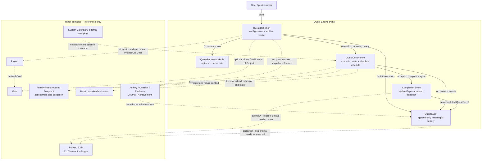

# Quest Engine — V1 domain/data architecture

Status: Conceptual design incorporating the Product Owner's Definition/Occurrence split and resolved DQ-01–04 and SQ-01–04. No SQL, migrations, application code or UI is introduced.

Owner: Human Product Owner. Date: 2026-09-17.

Sources: [project context](../PROJECT_CONTEXT.md), [architecture overview](overview.md), [accepted ADRs](decisions.md), and the reconciled [Quest requirements](../01-requirements/quest-engine.md). The requirements baseline was brought into this working branch from commit `ac10087` and updated alongside this document with the four resolved domain decisions; no branch merge was performed.

## 1. Purpose

Define the Quest Engine's conceptual entities, ownership, invariants and integration contracts before physical schema design. Map the product's executable Quest behavior to QuestOccurrence, including for one-off tasks, while Quest owns logical task configuration. Preserve history, exactly-once effects and domain boundaries.

## 2. Design Principles

- Separate intent/configuration from execution. Never collapse recurring history into one mutable Quest row.
- Supabase/PostgreSQL is the application data source of truth; Google Calendar is an integration.
- Keep lifecycle rules in domain/application services, not UI components.
- Keep EXP ledger ownership in Player/EXP and monetary accounting in Finance.
- Preserve meaningful events and financial/game progression history through append-only records and explicit compensation.
- Separate missed deadlines, confirmed failure, Health recommendations and Penalty determinations.
- Isolate all user-owned data by owner, including references and children.
- Specify conceptual constraints without choosing table layout, scheduler, transaction mechanism or transport.

## 3. Domain Overview

```text
Quest Definition
  ├── optional QuestRecurrenceRule
  └── one or more QuestOccurrences
         └── meaningful QuestEvents and external reward source references
```

A one-off Quest such as “Submit scholarship application” has one occurrence. “Wash motorcycle monthly” has independently executable September, October and November occurrences. A definition is neither completed nor failed; each occurrence is.

The model is conceptually one-to-many even if future recurring occurrences are materialized only when needed. No eager generation of the entire series is required. Operational creation timing is not fixed here. Requirement sections 7–10 refer to actionable Quest state; under this design those fields/actions belong to occurrences. This is a terminology refinement, not removal of one-off lifecycle support.

## 4. Entity Ownership

| Concept | Owning domain | Quest boundary |
| --- | --- | --- |
| Quest | Quest Engine | Logical definition and relatively stable configuration |
| QuestOccurrence | Quest Engine | One executable instance and its current lifecycle projection |
| QuestRecurrenceRule | Quest Engine | Local recurrence configuration belonging to a definition |
| QuestEvent | Quest Engine | Append-only meaningful definition/occurrence history |
| Completion Event | Quest Engine | A completed QuestEvent with a distinct stable ID per accepted transition; source for Player/EXP credit |
| User / profile | Identity/profile | Owner identity and validated IANA profile.timezone; required before recurrence creation/enablement |
| ExpTransaction | Player/EXP | Append-only reward and reversal ledger; references Quest source identity |
| Goal, Project | Goal/Project Engine | Optional parent references; owning engine calculates progress |
| PenaltyRule, PenaltySnapshot, obligation | Penalty Engine | Quest retains assigned version/snapshot reference and outcome references; penalty semantics stay outside Core |
| Workload estimate / recommendation | Health Engine | Consumes Quest metadata; recommends recovery/waiver/rescheduling |
| CalendarEvent / external mapping | Calendar/integration domain | Explicit link to definition/occurrence; not the Quest itself |
| Activity, Criterion, Evidence | Growth / Criteria / Evidence domains | Reference Quest identifiers/events from their own side |
| Journal entry, Achievement | Journal / Achievement domains | Independent decisions referencing Quest outcomes |
| Financial obligation accounting | Finance domain | No invented income or automatic bank transfer from Quest |

Physical placement of an immutable penalty snapshot may be decided later; its semantics and assessment ownership remain Penalty's. Quest must retain a durable association, not only a pointer to mutable rule content.

## 5. Quest Definition

Conceptual fields, not a table or final column specification:

| Information | Rule |
| --- | --- |
| id, owner/user | Required stable identity and owner |
| title | Required, nonblank, at most 120 characters |
| description | Optional, at most 4000 characters |
| importance | main or side; default side |
| priority | Optional low, medium, high or critical; no extra default invented |
| difficulty | Optional integer 1–5, retaining the requirement's optionality |
| estimated_duration_minutes | Nullable; null means unknown, otherwise positive integer minutes greater than zero; zero is invalid. Optional UI 5-minute increments are not a database invariant |
| energy_cost, focus_demand | Each optional integer 1–5; absent means unknown |
| reward_exp | Configured nonnegative integer explicitly assigned by creator/system; must be resolved before completion |
| goal reference, project reference | Each optional, but at most one direct parent |
| recurrence mode | one_off, daily, weekly, monthly or custom; default one_off |
| penalty policy/reference | Optional assigned immutable rule version/snapshot association |
| tags/categories, notes | Optional information retained from requirements; no additional strict text limits |
| created / updated timestamps | Absolute timestamps |
| archived state | Retention/visibility marker; not execution status |

`reward_exp` is a reward configuration, not an earned EXP balance. Earned amounts and reversals are ledger records. Quest has no completed status, completed timestamp, failure reason, Player balance or Criteria verification columns.

The definition holds reusable/default configuration. At occurrence materialization, execution-critical values are snapshotted or otherwise fixed as listed in section 6. Later definition edits affect future occurrences not yet materialized; they never silently mutate existing occurrences, including unfinished ones. Explicit occurrence-specific changes preserve meaningful audit history. Historical completed reward, workload, attribution and penalty values remain immutable.

## 6. Quest Occurrence

| Information | Rule |
| --- | --- |
| id, quest_id | Required stable identity and definition relationship |
| ownership association | Must resolve to the definition's owner; if owner is also stored, enforce consistency |
| planned/scheduled timestamp | Optional absolute time |
| deadline | Optional absolute time; not before planned start when both exist |
| status | draft, scheduled, active, completed, failed or cancelled |
| user-reported completion time | Optional and backdatable, distinct from authoritative recording time |
| authoritative recorded completion time | System-recorded accepted-completion time; not controlled by a client timestamp |
| failure reason / notes | Applicable reason plus optional explanation; reasons in section 13 |
| occurrence origin | Stable original recurrence-slot identity and relevant rule/version context for recurring instances |
| sequence/index | Optional useful ordering aid, not a substitute for stable identity |
| created / updated timestamps | Absolute timestamps |
| accepted outcome references | Stable completion/event and external effect references sufficient for retries, reconciliation and correction |
| fixed execution configuration | At materialization: reward_exp, difficulty, estimated_duration_minutes, energy_cost, focus_demand, direct Goal/Project contribution attribution and applicable Penalty Rule version/snapshot, including absent optional values |

Occurrence origin survives rescheduling. Changing its deadline does not create a second executable identity or reward opportunity. A one-off instance receives the same state/reward safeguards as a recurring one.

Current status/timestamp fields describe the current projection. Corrections must preserve previous values in events; reopening may change the projection but cannot erase its prior completion, reason or reward references. Completion facts retain the resolved reward and attribution context independently of mutable definition settings. Exact snapshot placement remains conceptual.

Even unfinished materialized occurrences retain their fixed values after definition edits. Scheduling/deadline data belongs to the occurrence. An intentional edit to one occurrence is an explicit occurrence-specific change with meaningful history, not template propagation. Historical completed reward amount, parent contribution attribution, penalty snapshot and workload values used in analysis must remain immutable. A reopened occurrence does not automatically inherit new defaults; any permissible change must be explicit and preserve earlier completion facts.

## 7. Recurrence Rule

A QuestRecurrenceRule belongs to one Quest definition. A one_off definition has no active repeating rule; repeating modes require a coherent rule. Model no more than one current effective rule per definition, preserving previous rule information through recorded versions/events rather than overwriting history without trace.

The rule expresses cadence, local anchor/date/time needed to interpret slots, selected weekdays where relevant, monthly target day, positive integer interval for every N days/weeks, optional end date, optional positive occurrence count, and whether generation is stopped. If both end limits exist, neither may be exceeded. Concrete field arrangement is deferred.

The occurrence count limit counts actual materialized instances across the logical Quest's history, not skipped calendar slots. It survives edits to schedule/anchor, stopping, cancellation and reopening. With limit 10 and 3 materialized instances, a Monday-to-Saturday change permits at most 7 more; missed unmaterialized weeks consume nothing and generate no catch-up backlog. Stop at the limit, end date, explicit stop or archive. The physical schema maintains a server-only cumulative materialization counter under the Quest lock; successful new instances increment it once, retries and rule edits do not.

Supported patterns are daily, selected weekdays, monthly, every N days and every N weeks. Google Calendar does not own this rule. Profile timezone interpretation and month-end fallback are in section 18.

Rule changes record the old/new rule and effective boundary and affect future occurrences not yet materialized. Existing schedules and fixed values remain unchanged; adjusting or cancelling a materialized occurrence requires an explicit occurrence-specific action and meaningful audit history. Never implicitly revise historical schedules or regenerate an existing slot.

Stopping recurrence prevents new future generation, keeps the definition available and does not archive it or remove/change existing materialized occurrences. A separate explicit cancellation remains possible. Archiving has additional guarded effects in section 19: it stops generation and cancels only clean eligible work under the full history-aware predicate while preserving history.

Repeated generation attempts must identify the same slot rather than duplicate it. Editing a rule must not create another entitlement for retained work merely because a rule version changed. The materialization horizon, scheduler/cron and exact slot-key representation are deliberately not selected. Missed slots alone must not generate cascading penalties or an excessive historical catch-up backlog.

## 8. Quest Event / Audit Log

QuestEvent is an append-only record of a meaningful business action. Conceptually retain stable event identity, owner association, quest_id, optional occurrence_id, event type, authoritative recorded time, actor/source, relevant prior/new facts, reason/context, and related command/effect/correction references. An occurrence event must refer to an occurrence belonging to the same Quest and owner. A definition-only event does not require an occurrence.

| Event | Typical subject and meaning |
| --- | --- |
| created | Definition/occurrence captured |
| scheduled, activated | Occurrence planned or explicitly begun |
| completed | Completion Event with a new stable ID for each accepted transition; recorded/reported times, fixed reward amount and source reference; retries return this same event |
| completion_corrected | Audited correction; references prior completion and compensation when undone |
| failed, failure_reason_changed | Confirmed outcome or explicitly amended reason; old facts retained |
| penalty_waived | Reference to explicit Penalty disposition, not a Core waiver calculation |
| rescheduled | Same occurrence; previous/new schedule preserved |
| cancelled, reopened | Explicit lifecycle resolution or correction with prior/new state |
| archived | Definition retired only after full unfinished-work guard; recurrence stopped and qualifying clean draft/scheduled cancellations recorded with history retained |
| recurrence_changed | Definition rule change and effective boundary |

Other meaningful actions such as deferral or series stopping must be explainable in history; naming them does not prescribe an exhaustive event enum. Do not require a business event for every minor text edit. An update timestamp is not a substitute for lifecycle history.

Append-only means accepted historical facts are not edited/deleted to disguise a correction. Additional events explain amendments. It does not require adopting event sourcing or rebuilding every view from events. Retry deduplication applies to semantic events, not merely identical HTTP requests.

Each legitimate transition into completed creates a distinct Completion Event. Reopening preserves the old event and its credit/reversal references; legitimate recompletion creates a new event, never mutates or reuses the prior one. Repeated requests for the same transition create neither another event nor another credit.

## 9. State Ownership

| Concept | State ownership |
| --- | --- |
| Quest | Configuration and archival; never executable completion/failure status |
| QuestOccurrence | Six execution states and applicable current completion/failure information |
| QuestRecurrenceRule | Scheduling configuration and stopped/active generation condition |
| QuestEvent | Historical immutable action; not another mutable lifecycle |
| Player/EXP and Penalty | Their own processing/ledger/disposition state, separate from occurrence status |

Draft can be scheduled with a start/deadline or explicitly activated. Draft/scheduled/active can complete, fail, cancel or reschedule. Rescheduling returns the same occurrence to scheduled with a valid new plan and an event. Deferral without a replacement date returns scheduled/active work to draft and preserves removed dates in history. Merely reaching a start time does not assert activation.

Completed/failed/cancelled end ordinary execution, but explicit audited reopening may return to a valid draft/scheduled/active state. Undoing completed work requires compensation. A repeated completion of an already accepted outcome is a no-op for effects. Ordinary requests cannot silently reopen outcomes. Conflicting transitions resolve to one authoritative result.

`rescheduled`, `overdue`, `waived` and `archived` are not extra execution states. Overdue is a time condition; waiver is a Penalty disposition; archival is retention. No deadline automatically turns work into punishable failure.

Definition archival uses the full history-aware eligibility predicate in section 19. Active, overdue, previously started and other meaningfully executed unfinished work requires explicit user resolution before archive; merely deferring it back to draft/scheduled does not make it clean. Stop alone never changes existing occurrence states.

## 10. Relationships

- One owner has many Quest definitions; each definition belongs to exactly one owner.
- One Quest has its executable occurrences; one_off has one, while recurring work has separately identified instances. No Quest-to-Quest hierarchy is introduced.
- One Quest has zero or one current recurrence rule, with preserved change history.
- QuestEvents belong to a definition and optionally one of its occurrences.
- **At most one direct parent relationship:** a Quest belongs to one Project OR directly to one Goal, or neither. When a Project has a Goal, derive that relationship through Project.
- Parent, penalty and internal calendar references must obey ownership/access boundaries. Archived parents preserve historical relationships but receive no new progress contribution, including delayed delivery after archival.
- Goal/Project owns calculation; Quest provides occurrence completion/correction information and stable contribution sources. Do not assume all Goals use the same formula or duplicate direct Goal contribution through a Project.
- Direct parent contribution attribution is fixed per occurrence at materialization, retaining the same at-most-one-parent rule. Definition reassignment cannot retarget materialized or historical contributions.

Goal/Project identities are UUID-compatible. Keep nullable identifiers and fixed attribution snapshots without inventing target schemas or invalid FKs; add owner-safe restrictive FKs when the external tables exist. Domain-level ownership validation remains necessary before accepting nonnull associations.
- External domains reference quest_id, occurrence_id and relevant events from their own side. Quest Core does not absorb their tables or verification state.

## 11. Completion and EXP Contract

Completion validates ownership, eligible occurrence state and its fixed nonnegative integer reward_exp. Each accepted transition consistently establishes completed state, immutable completion facts, authoritative recorded time, optional reported/backdated time, a distinct stable Completion Event ID and a durable reward entitlement. Do not acknowledge success with a lost entitlement or grant EXP without an accepted Completion Event.

Quest supplies Player/EXP with owner, quest_id, occurrence_id, stable accepted-completion source, reward reason, resolved amount and relevant event/time references. Player/EXP owns the append-only ExpTransaction ledger and applies a source once. No mutable earned-EXP counter belongs on Quest. An explicit zero reward still has a recorded completion outcome. Late completion causes no implicit reduction and never invents money.

The [canonical V1 EXP envelope](quest-event-payload-v1.md) fixes completion/correction JSON paths, types, source/receipt mappings and atomic preallocation without freezing unrelated Quest payload fields.

The future ledger contract is `source_type = quest_completion`, `source_id = completion_event_id`, `reason = completion_reward`, `amount = reward_exp_snapshot`. Reversals refer to the original credit. Player owns final credit/reversal idempotency. Quest schema may be migrated first, but production operations promising atomic completion plus EXP credit (and its compensated reopening) remain disabled until Player Ledger schema/contract is implemented and integrated. No ledger schema is designed here.

Reward idempotency is keyed by accepted Completion Event ID plus reward reason/type. Occurrence ID remains attribution/context, not a lifetime credit uniqueness key. Five retries, double-clicks or concurrent requests for the SAME completion produce one accepted event and one credit, even if client request IDs differ. A legitimate new transition after explicit reopen creates a NEW Completion Event with its own independently idempotent credit. At any moment an occurrence must have at most one unreversed completion entitlement. Stale earlier requests must not create new events or resurrect reversed credits.

Player/EXP must recognize duplicate sources even if a response was lost. If an effect is pending, report that truthfully and recover without remaking the completion event. Progress consumers likewise deduplicate accepted contributions. No transaction, queue, outbox or transport implementation is selected here.

## 12. Correction / Reward Reversal

An explicit correction preserves original lifecycle events and transactions. Reopening completed work must create a completion_corrected/reopened audit trail and request a compensating Player/EXP transaction linked to the original credit. Reverse the actual granted amount, not the current Quest configuration. Repeated reversal requests must not reverse a credit twice.

Keep owner, occurrence, correction source and original transaction references stable across retries. Coordinate updated occurrence state, audit and reversal entitlement consistently; partial failures must be recoverable and must not be misreported as finished. Original transactions are never deleted. Metadata-only corrections that do not undo completion do not automatically reverse EXP.

Failed/cancelled work can reopen without an EXP reversal if no completion credit was granted. For completed work, preserve the original Completion Event and transaction, create its compensating reversal and record correction/reopening before the occurrence becomes executable again. Later legitimate completion creates a NEW Completion Event whose credit is independently idempotent. Coordinate processing so an occurrence never has more than one unreversed completion entitlement, including during concurrent retries and recovery. Downstream domains receive correction references and reconcile their own contributions without erasing history. Quest does not implement their formulas.

## 13. Failure Contract

Occurrence failure reasons are `procrastinated`, `forgotten`, `overloaded`, `recovery_needed`, `emergency`, `no_longer_relevant` and `other`. The user is final authority for confirmation in V1. Optional notes explain circumstances; an explicit reason change appends history.

Passing a deadline records/derives a missed condition, including when the app was closed. It does not itself confirm failure or apply a penalty. Explicit outcomes can be failure, rescheduling, deferral or cancellation; penalty assessment is independent. A Health recommendation may inform a waiver, but explicit determination is required. Lack of Health metadata proves neither overload nor misconduct.

Failure events expose occurrence identity, confirmed reason, time/context and applicable retained penalty reference. They do not create an automatic recursive punishment chain. A delayed completion cannot silently override a failed/cancelled outcome.

## 14. Health Boundary

Quest provides occurrence-fixed estimated duration, difficulty, energy cost, focus demand, relevant schedules and occurrence status. Historical analysis uses the preserved values, not current definition defaults. Estimates remain distinguishable from missing information and actual outcomes. Health consumes this information for workload/recovery estimation, never medical diagnosis.

Health may recommend rescheduling or waiver. Quest records the explicit user/system action taken; recommendations themselves do not automatically transition or punish an occurrence. The user confirms the failure reason, and Penalty records its explicitly determined disposition. No Health algorithm is part of Quest Core.

## 15. Penalty Boundary

Quest references an optional Penalty configuration and retains its assigned version/snapshot association, as required by FR-11 and AC-29. When that rule becomes applicable to a failure/obligation, preserve the exact applicable snapshot and source occurrence/outcome reference. Capturing only the latest mutable rule at assessment would not meet the existing assignment guarantee.

Fix the applicable Penalty Rule version/snapshot for each occurrence at materialization, alongside reward, workload and direct parent attribution. Definition/source edits do not replace it on existing occurrences; completed historical snapshots remain immutable.

The retained envelope supports at minimum schema_version, optional source_rule_id and immutable applicable rule data sufficient to interpret the obligation. JSONB may preserve this foreign-domain contract without normalizing Penalty's schema. An absent source ID is valid; source existence/version lookup must not be required to interpret retained history.

Later edits/deletion of the source PenaltyRule cannot alter the assigned policy or existing/pending obligation. Penalty owns applicability, assessment, waiver and obligation rules; Core supplies confirmed failure context and retains outcome references. Repeated assessments must not duplicate obligations. Health recommendations are inputs, not final punishment decisions.

Physical/custom, EXP and savings-allocation obligations remain distinct. Financial obligations are tracking/accounting only; no automatic bank transfers or invented income. A penalty-origin task must carry enough origin context to prevent recursive escalation when it fails. The minimum snapshot envelope is defined above; detailed Penalty rule data and the full Penalty database remain outside Quest ownership.

## 16. Calendar Boundary

The internal System Calendar may represent an occurrence's schedule through an explicit link while remaining a separate domain. Changes to occurrence scheduling expose updated information; they do not manufacture a new executable identity.

Google Calendar integration is read/import-first. External event != Quest. Explicit conversion/linking is required and retries must not duplicate the converted Quest/occurrence. Calendar/integration owns external identifiers/mappings; Quest does not use an external event ID as its sole execution identity.

Deleting an external event never automatically deletes an already-created Quest, its occurrence or history, and does not itself complete/fail/cancel it. Two-way external synchronization is outside V1. Google does not own Quest recurrence or authoritative application data.

## 17. Criteria / Evidence Boundary

Quest exposes stable quest_id, occurrence_id, lifecycle/status, timestamps, completion/failure/correction events and relevant metadata. Activity, Criterion, Evidence, Journal and Achievement can reference these from their own domain side.

Completion alone does not verify a Criterion, approve Evidence, establish Activity participation or award an Achievement. Owning engines decide those outcomes. No university/scholarship-specific, evidence-approval or achievement-award columns belong in Quest Core. Requirement systems remain data-driven; estimated progress is not verified proof.

## 18. Time and Timezone Model

Persist actual scheduling, deadline, event and recording instants conceptually as absolute timestamps. Rule anchors such as local weekday/time and monthly day are calendar configuration interpreted using the user's profile timezone, not incorrectly treated as absolute instants themselves.

The timezone dependency is exactly `profile.timezone`, owned by Profile and validated as an IANA identifier. Creating/enabling recurrence and materializing future instances require a valid value; invalid/missing data blocks that operation without a guessed fallback. One-off Quests can exist without recurrence configuration. The Profile table itself is outside Quest ownership and will be designed separately.

The current owner's initial profile timezone may be `Asia/Ho_Chi_Minh`, never a universal hard-coded timezone. Recurrence generation interprets unmaterialized future slots in current profile local time. Materialized occurrences retain their existing absolute schedule when profile timezone changes; display formatting may change without moving the instant. Only an explicit audited occurrence-specific reschedule changes existing pending work; a timezone or definition-rule edit alone cannot silently rewrite materialized schedules or history.

One-off timestamps retain absolute time. Monthly day 31 uses the final valid day in shorter months, then returns to the intended day in subsequent months. Avoid duplicate slots after generation retries/rule changes. Advanced travel, per-series timezone and DST policy are outside V1.

User-reported completion time can be backdated; authoritative recording time cannot. Preserve both and their provenance so late work and late recording are distinguishable. V1 is not offline-first, but delayed/replayed requests still require ownership, current-state and idempotency checks.

## 19. Deletion / Archival Rules

Meaningful history includes actual activation/execution, completed/failed/cancelled outcomes, explicit corrections/reopening, consequential scheduling changes, reward/reversal records, penalty assessments/obligations and external contribution references that must remain attributable. Creation of a never-executed draft and minor edits alone need not make it permanently undeletable.

A Quest with meaningful execution/history must be archived rather than hard-deleted. Its occurrences, events and external source references remain valid and accessible to the owner. Do not cascade-delete historical children when a definition, rule or parent is removed. Archival alone does not undo completion or reverse rewards.

A never-executed Quest with no meaningful history or durable dependent references may be deletable. Append-only business-history protection must not be evaded by relabeling executed work as a draft. Exact handling of trivial creation records during permitted draft deletion can be specified with physical retention design; no cleanup job is proposed.

Stopping and archiving are distinct actions:

- **Stop recurrence:** prevent new future generation, retain the available definition without automatically archiving it, and leave existing materialized occurrences and completed history unchanged.
- **Archive Quest:** retire from active use and automatically stop recurrence only after all blocking unfinished work has been explicitly resolved. Automatically cancel only clean draft/scheduled instances that have never entered active/execution and have scheduled_at null or strictly in the future. Overdue work and any other meaningful unfinished execution history are excluded even if the simple status/time test passes. Preserve cancellations, all terminal history, Quest Events, credits and reversals; never reverse earned EXP automatically.

The guard blocks active occurrences, overdue scheduled occurrences, previously activated/deferred draft/scheduled work and any other unfinished meaningful execution history. Explicit completion/failure/cancellation or appropriate rescheduling can resolve blockers, followed by full re-evaluation; rescheduling never removes prior execution. Use lifecycle/audit information, not current status alone, to prove never-started. Apply one archive decision instant consistently. Guard/effects must be atomic with concurrent activation/materialization so archive cannot bypass a blocker or permit generation afterward.

## 20. Domain Invariants

| ID | Invariant |
| --- | --- |
| INV-01 | Every definition has an owner; every child/effect reference has consistent ownership |
| INV-02 | Default configuration belongs to Quest; fixed execution values and state belong to QuestOccurrence, including one-off work |
| INV-03 | At most one direct Goal/Project parent; Project's Goal is derived |
| INV-04 | One recurring slot must not generate duplicate executable occurrences; rescheduling retains identity |
| INV-05 | Importance and recurrence are independent; defaults are side + one_off |
| INV-06 | Only six persistent execution states; rescheduled/overdue/waived are not additional states |
| INV-07 | Each accepted transition into completed has a stable Completion Event ID; event ID + reward reason/type identifies its unique credit; retries create no new event/credit |
| INV-08 | Undo preserves original credit and creates at most one effective compensation for that credit |
| INV-09 | Definition/rule edits affect only unmaterialized occurrences; existing fixed values require explicit occurrence-specific changes and completed historical values remain immutable |
| INV-10 | Deadline passage does not automatically confirm failure or impose punishment |
| INV-11 | Archived parents retain relationships but receive no new progress; Quest does not calculate parent progress |
| INV-12 | EXP is ledger-owned by Player/EXP and is distinct from money |
| INV-13 | Completion does not automatically verify evidence/criteria or award achievements |
| INV-14 | Meaningful lifecycle/audit history cannot be hard-deleted; corrections are attributable additions |
| INV-15 | Profile timezone changes do not silently alter materialized absolute timestamps |
| INV-16 | At any moment an occurrence has at most one unreversed completion entitlement; a new completion after reversal uses a new event |
| INV-17 | Supplied duration is a positive integer; null means unknown and zero is invalid |
| INV-18 | Stop preserves existing instances; archive stops generation and auto-cancels only clean eligible work, blocks all other unfinished work pending explicit resolution, preserves audit/history and never reverses EXP automatically |
| INV-19 | Recurrence requires valid Profile-owned profile.timezone; no guessed timezone and no universal Asia/Ho_Chi_Minh default |
| INV-20 | occurrence_limit counts actual materializations across the logical Quest; skipped slots, retries and rule edits neither consume nor reset capacity |

## 21. Suggested Database Constraints

These are candidates for later PostgreSQL schema enforcement, not SQL or a schema commitment. Some require guarded service operations in addition to row constraints.

| Candidate database-enforceable rule | Qualification |
| --- | --- |
| Required identifiers, owner and nonblank title; title at most 120, description at most 4000 characters | Preserve optional description and existing text limits |
| Importance, recurrence mode, optional priority, occurrence status and applicable failure reason in allowed values | Do not introduce extra persistent states |
| Optional difficulty/energy/focus are integers 1–5 | Preserve nullable fields |
| Reward EXP is integer and at least zero when assigned | Completion additionally requires a resolved value |
| Duration is null or a positive integer greater than zero | Zero invalid; multiples of five are not required; applies to defaults and occurrence values |
| At most one direct Goal/Project reference | Both absent is allowed |
| Positive recurrence interval and optional positive occurrence count | Mode-specific combinations need validation too |
| Deadline not before planned start when both supplied | Rule local dates/time are interpreted separately |
| Referential integrity among definition, occurrence, rule and event | Protect meaningful history from cascading deletion |
| Child-owner consistency and occurrence/event association consistency | Exact composite references versus controlled joins are physical-design choices |
| Unique original occurrence-slot identity; one one-off instance | Exact key and race-safe creation remain implementation design |
| Unique Completion Event identifier and unique credit source of Completion Event ID + reward reason/type; unique reversal-of-credit | Quest owns accepted event identity; Player/EXP owns credit/reversal enforcement; no lifetime occurrence-only credit uniqueness |
| Append-only audit/ledger write expectations | Requires permissions/controlled write paths, not merely a row check |

Service/business-layer invariants include valid transitions, deduplicating retries before minting Completion Events, at most one unreversed entitlement per occurrence, materialization-time snapshots, historical-value immutability, explicit occurrence edits, archived-parent contribution suppression, definition edits affecting unmaterialized work only, and guarded archive/stop behavior. Also enforce identity preservation on rescheduling, cross-domain reversal consistency, explicit waiver decisions, permission-aware deletion and no recursive penalties. Reinforce these with database protections where practical; row checks or ordinary RLS alone cannot enforce the whole cross-record/domain workflow.

Additional cross-record invariants: maintain the materialization count exactly once with each new occurrence under the Quest lock; preserve it across recurrence edits; validate profile.timezone before recurrence operations; and evaluate archive eligibility against immutable execution/audit history plus current schedule/deadline, not merely current status. These are not standalone row CHECK rules.

## 22. Suggested Indexing Considerations

Start from actual query plans and avoid duplicate indexes already supplied by primary/unique constraints. These are likely V1 candidates, not a required index set:

| Access pattern | Candidate leading fields | Why |
| --- | --- | --- |
| User's Quest list | owner, archived state; optionally update time | Scope active/archive lists without scanning other users |
| Today's/scheduled occurrences | owner or owner-filtered Quest relationship, status, planned timestamp | Retrieve a profile-local day's absolute time window |
| Upcoming/overdue deadlines | owner, deadline, with relevant unfinished-state filtering | Find unresolved deadlines without completed history dominating scans |
| Occurrence history | quest_id, recorded/created time and stable tie-breaker | Retrieve ordered execution history for a definition |
| Recurring generation | Quest/rule active condition and rule identity; occurrence slot uniqueness | Find applicable definitions and detect already materialized slots; no next-run column or scheduler is mandated |
| Quest event history | quest_id or occurrence_id, recorded time and stable event identity | Read definition-wide or occurrence-specific audit trails |

Only store/index owner on children if the chosen ownership design maintains its consistency; otherwise evaluate a join-supported index. Additional indexes need observed access patterns, not speculative dashboards.

## 23. Security / RLS Considerations

All user-owned Quest data must be isolated by authenticated owner in Supabase/PostgreSQL. A user may only read or act on their own definitions, occurrences, rules and audit history. Guessing an occurrence/event identifier must not reveal a record or bypass its parent ownership checks.

Authorize child inserts/updates against the owning definition; validate all referenced parents and domain sources to prevent cross-owner links. If owner is denormalized, it cannot be freely reassigned independently of the parent. Protect retained rule snapshots, archived history and external mappings as user data too.

Profile timezone access and external Goal/Project resolution must use the same authenticated owner context. Materialization counts and history-derived archive eligibility are server-owned facts; clients cannot reset counters or hide prior execution through direct writes.

Normal client code must never bypass RLS or receive service-role credentials. Do not allow arbitrary client writes to completion events, reward amounts already accepted, audit history or EXP transactions. Use an authenticated, authorized domain operation that enforces transitions and effect consistency; transport/security-definer details are not chosen here. Player/EXP independently validates source ownership and deduplicates authorized operations.

Read permission is not permission to mutate audit records. Restrict update/delete of meaningful events and ledger entries, while implementing any permitted trivial-draft deletion through the retention rules. No RLS SQL or privileged execution design is supplied.

## 24. Example Lifecycle Scenarios

| Scenario | Quest-owned changes | External-domain changes / unchanged facts |
| --- | --- | --- |
| 1. One-off application submission completed | Definition materializes one occurrence with fixed execution values; transition creates Completion Event C1 for its 50 EXP snapshot | Player/EXP credits source C1 + completion reason once; parent attribution comes from the occurrence; Quest has no earned-balance field |
| 2. Monthly motorcycle washing on day 31 | One Quest and rule; September occurrence on September 30, October on October 31, November on November 30; each has its own state/events | Completing September rewards only September; future instances remain independent |
| 3. Five completion retries | All requests resolve to the same stable Completion Event C1, with no additional events | C1 + reward reason grants once even with different client request IDs |
| 4. Completion corrected/reopened | Preserve C1; reverse its credit and audit reopening before execution resumes; legitimate recompletion creates C2 using the occurrence's fixed reward | Original +50 and compensating -50 remain; C2 receives independently idempotent +50; never more than one unreversed entitlement |
| 5. Deadline missed, overload waiver | Occurrence first becomes overdue without automatic state change; user confirms overloaded and failure; failed and penalty_waived reference events retain decisions | Health recommends waiver; Penalty records explicit waiver, no obligation; no automatic medical inference |
| 6. Monthly rule edited | Record rule change/effective boundary; only not-yet-materialized slots inherit it; editing an existing occurrence is a separate explicit audited action | Existing absolute schedules, fixed values and past outcomes remain unchanged by the rule edit |
| 7. Parent Project archived | Quest parent link and occurrence history remain; completion may still proceed | Project archives in its domain; receives no new progress, including late delivery; independently valid EXP is not undone |
| 8. External Google Calendar event deleted | Already-created Quest, occurrence and audit remain; no lifecycle transition follows from deletion | Calendar/integration updates its external mapping/import state; no two-way sync or Quest cascade deletion |
| 9. Defaults edited after materialization | Definition reward changes 50 to 80 and parent/workload/penalty defaults change; existing occurrence retains all seven fixed execution values, while a new occurrence inherits new defaults | Historical analysis, contributions and obligations do not change retroactively |
| 10. Stop versus archive | Stop leaves definition/instances unchanged; archive first blocks all unresolved active, overdue or previously executed work, then cancels only clean never-started draft/scheduled instances with null/future start | All cancellation/history/events retained; no automatic reversal |
| 11. Archive with execution/overdue blockers | Active, previously active but deferred, overdue or otherwise meaningfully executed unfinished instances block archive until explicit resolution and re-evaluation | A new future date never erases activation history |
| 12. Duration validation | Null is unknown; 1 and 7 minutes accepted, zero/negative/fractional values rejected in default and occurrence values | UI 5-minute steps impose no multiple-of-five storage restriction |
| 13. Limit 10 with skipped weeks and schedule edit | Three skipped unmaterialized weeks consume nothing; after 3 actual materializations, changing Monday to Saturday leaves capacity for at most 7 more | No catch-up backlog and no count reset |
| 14. Missing profile timezone | One-off work can exist; recurrence creation/enablement/materialization rejects missing/invalid profile.timezone | Profile remains a separate domain; no fallback zone guessed |
| 15. Penalty envelope without source | Retain schema_version and immutable applicable rule data even with no source_rule_id | Rule interpretation does not depend on live source existence |

## 25. Mermaid Domain Diagram



Dashed edges are cross-domain contracts, not ownership of external tables. Events can identify both Quest and occurrence; external domains can reference either identity as well as events. The diagram's two parent edges are mutually exclusive direct relationships, not permission to assign both.

## 26. Open Questions

There are no remaining blocking Quest V1 database/domain design questions. DQ-01–04 and SQ-01–04 are incorporated into the requirements, this model and the physical schema. Separately owned Profile, Goal/Project, Penalty and Player implementations remain delivery dependencies governed by the documented contracts, not unresolved Quest policy.
